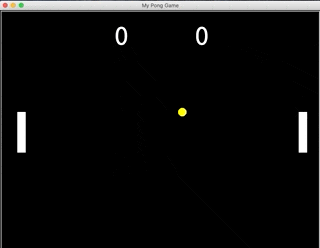

## 100 Day Challenge: Day 22 - The Pong Game
##### Python GUI Desktop App Development practice.
- The ball will bounce back when hitting both the top and the bottom wall.
- The speed of the ball will increase whenever it being hit by a paddle.
- One point added to the other player when a player missing the ball.

